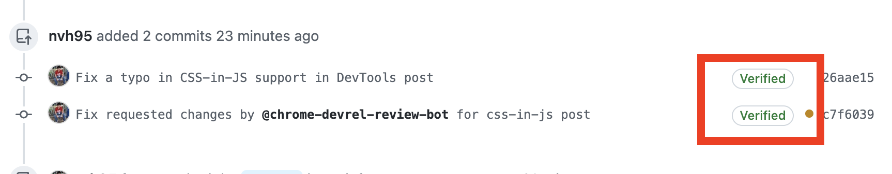
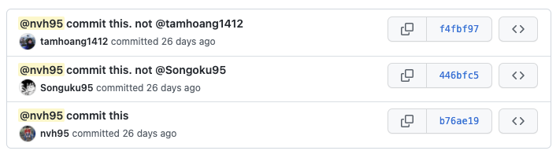
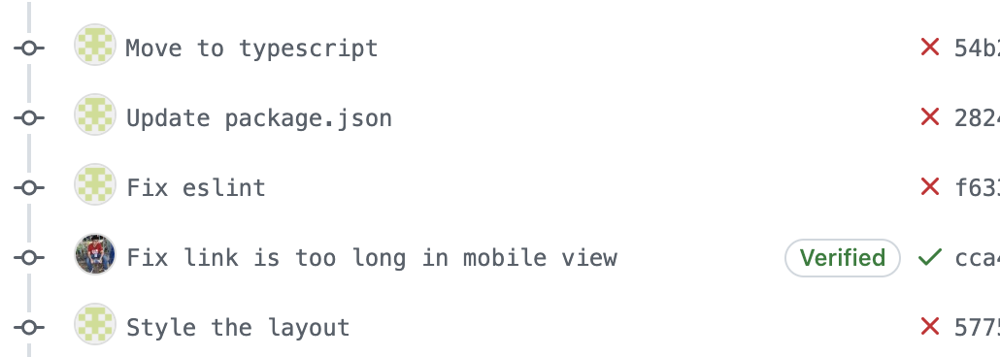
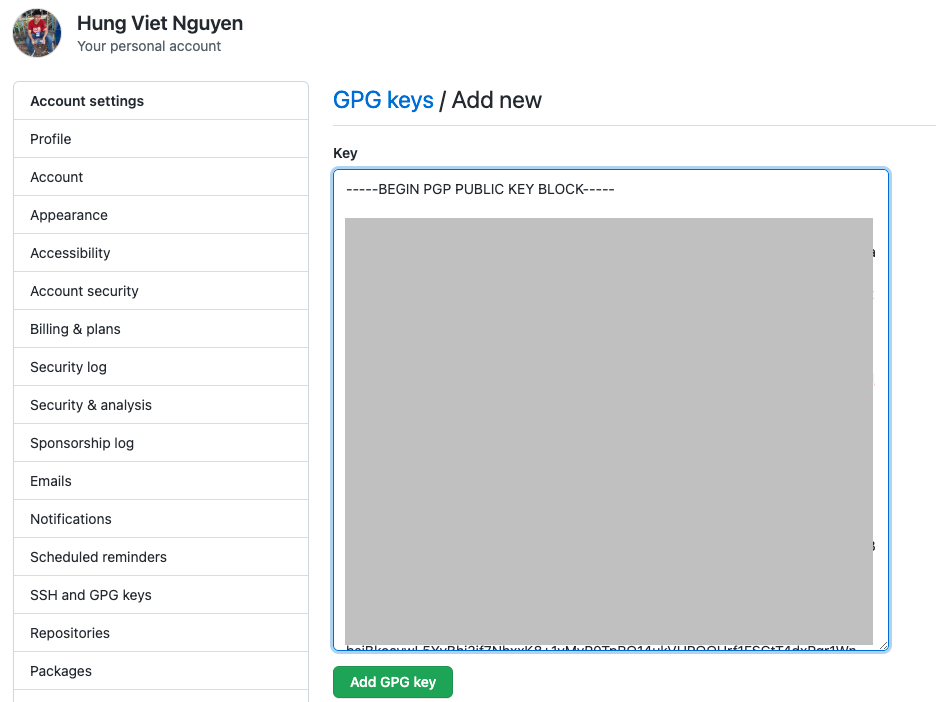
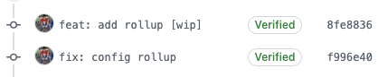

## Mở đầu


Facebook có tính năng “tích xanh” để xác minh rằng một tài khoản là chính chủ. Vậy đối với developer - **người chơi hệ code**, liệu có tính năng tương tự không? Câu trả lời là có. Nếu bạn sử dụng Github đủ lâu, bạn sẽ biết github cũng có tính năng tích xanh, nhưng là xanh lá cây.


<figcaption>Commit “chính chủ”</figcaption>

Trong bài viết này, chúng ta sẽ cùng tìm hiểu tính năng này là gì và làm sao để sử dụng tính năng đó nhé.

## Commit Signature Verification

Tính năng “tích xanh” của github tên đầy đủ là **Commit Signature Verification**, là một tính năng để xác thực rằng, commit được đẩy lên là do chính chủ đẩy lên, không phải là một ai khác. Vậy câu hỏi đặt ra là: “Liệu tôi có thể giả vờ làm người khác commit code, rồi push code lên sao?”. Thì câu trả lời là: “Có. Chắc chắn rồi”. Giống như facebook, bạn hoàn toàn có thể lập một tài khoản với tên bất kì (ví dụ: [Đen Vâu](https://www.facebook.com/denvau)), và viết một bài đăng như thể chính Đen Vâu đang trò chuyện với Đồng Âm vậy. Tuy nhiên, tài khoản của bạn sẽ không có tích xanh như tài khoản của Đen Vâu, và sẽ nhiều người nhận ra tài khoản bạn mới lập là pha-ke. Quay trở lại với code, nếu còn chút ngờ vực, hãy nhìn vào hình ảnh dưới đây:



<figcaption>Giả mạo @tamhoang1412 và @Songuku95. Nguồn: <a href="https://github.com/nvh95/fake-committers/commits/master" target="_blank" rel="nofollow noopener noreferrer">https://github.com/nvh95/fake-committers/commits/master</a></figcaption>

Hình trên là ảnh chụp từ repo [fake-committer](https://github.com/nvh95/fake-committers), trông thì có vẻ như @nvh95, @tamhoang1412 và @Songuku95 mỗi người có 1 commit. Tuy nhiên thực tế thì @tamhoang1412 và @Songuku95 không hề biết đến sự tồn tại của repo [fake-committer](https://github.com/nvh95/fake-committers), hai commit của hai bạn này hoàn toàn bị @nvh95 giả mạo.

Tính năng tích xanh hoạt động như sau: Bạn sẽ kí (sign) commit bằng một khoá bí mật, đồng thời bạn upload khoá công khai lên github. Khi đó, mỗi khi bạn push code lên github, nó sẽ sử dụng khoá công khai để xác thực xem có đúng bạn là người tạo ra commit đó hay không. 

## Lợi ích của “tích xanh” Github

Như ví dụ bên trên, lợi ích rõ ràng nhất của “tích xanh” đó là để xác nhận rằng commit của mình tạo ra là “chính chủ”, là “hàng auth”. Một commit có tên mình là committer chưa chắc chắn đã là commit do mình tạo ra (nhỡ ai đó chơi xấu mình commit bug rồi đẩy lên thì sao 😂), nhưng một commit có “tích xanh” thì chắc chắn đó là commit authentic. Ngoài ra, một lợi ích khác mà mình thấy cũng rất quan trọng, đó là trông nó “pro” hơn rất nhiều 🤣🤣🤣. Giữa một rừng các commit trắng toát, commit của mình có tích xanh trông rất xịn xò và nổi bật.



<figcaption>Nổi bật trong PR với tích xanh</figcaption>

## Các bước để tạo “tích xanh”

Có vài cách để có được tích xanh, nhưng đơn giản và phổ biến nhất đó là sử dụng [GPG](https://gnupg.org/) (GNU Privacy Guard). Bạn đọc có thể tham khảo docs chính thức tại đây **[GPG commit signature verification](https://docs.github.com/en/authentication/managing-commit-signature-verification/about-commit-signature-verification#gpg-commit-signature-verification).** Trong khuôn khổ bài viết này, mình sẽ tóm tắt sơ lược các bước thực hiện:

### 1. Kiểm tra đã có GPG key trên máy chưa

- Kiểm tra bạn đã có `gpg` chưa bằng cách gõ `gpg` vào terminal. Nếu chưa có [vô đây download](https://www.gnupg.org/download/index.html) (download ở phần **GnuPG binary releases** nhé).
- List các GPG key đang có ở máy bằng lệnh:

    ```bash
    gpg --list-secret-keys --keyid-format=long
    ```
  - Nếu chưa có GPG key, chuyển sang bước 2.
  - Nếu có GPG key rồi, chuyển sang bước 3.

### 2. Tạo GPG Key

Chạy lệnh dưới đây, làm theo hướng dẫn điền để chọn loại mã hoá, tên, email, passphrase của bạn để tạo ra một GPG key mới:

```bash
gpg --full-generate-key
```

Chạy lệnh dưới đây để hiện long form của GPG key:

```bash
gpg --list-secret-keys --keyid-format=long
```

Copy long form của GPG key ID, ví dụ như ở trường hợp này nó là `3AA5C34371567BD2`:

```bash
$ gpg --list-secret-keys --keyid-format=long
/Users/hubot/.gnupg/secring.gpg
------------------------------------
sec   4096R/3AA5C34371567BD2 2016-03-10 [expires: 2017-03-10]
uid                          Hubot 
ssb   4096R/42B317FD4BA89E7A 2016-03-10
```

Chạy lệnh dưới đây để lấy ra GPG key, thay thế `3AA5C34371567BD2` bằng long form của GPG key ID:

```bash
gpg --armor --export 3AA5C34371567BD2
```

- Copy GPG key bắt đầu bằng `----BEGIN PGP PUBLIC KEY BLOCK-----` và kết thúc bằng `----END PGP PUBLIC KEY BLOCK-----` để chuẩn bị cho bước 3.

### 3. Thêm GPG key vào github

Copy key ở bước 2 vô đây [https://github.com/settings/gpg/new](https://github.com/settings/gpg/new). Sau đó nhập password vào để confirm.



### 4. Báo cho git biết bạn có GPG key mới

Chạy lệnh sau, với `3AA5C34371567BD2` là long form của GPG key ID như ở bước 2:

```bash
git config --global user.signingkey 3AA5C34371567BD2
```

Command bên trên sẽ có tác dụng global. Trong trường hợp bạn muốn sử dụng GPG key khác cho một local repo, bạn có thể sử dụng lệnh:

```bash
git config user.signingkey BAF7C50535B4A174
```

### 5. Kí

Bước cuối cùng bạn chỉ cần kí các commit là được. Bạn có thể kí từng commit một bằng option `-S`, ví dụ:

```bash
git commit -S -m "Commit nay chinh chu"
```

Tuy nhiên bạn sẽ muốn việc kí mọi commit trong tương lai mà không cần phải thêm `-S` mỗi khi commit. Để làm được việc đó, bạn chạy lệnh:

```bash
git config --global commit.gpgsign true
```

Tada, vậy là xong, mọi commit của bạn lên github sẽ trông rất authentic trở từ giờ trở đi.



## Bonus: Vigilant Mode

Quay lại câu chuyện trước khi kí, nếu ai đó giả mạo bạn commit, thì commit đó cũng chỉ trắng xoá. Vậy có cách nào tốt hơn không? Câu trả lời chính là **[Vigilant Mode](https://docs.github.com/en/authentication/managing-commit-signature-verification/displaying-verification-statuses-for-all-of-your-commits)**. Khi bật chế độ này lên, nếu các commit nào của mình mà không được kí, sẽ có tag `Unverified` màu vàng bên cạnh, sẽ dễ dàng để người khác biết được commit đó có được kí bởi bạn hay không. Chi tiết hơn các bạn hãy xem tại **[Displaying verification statuses for all of your commits](https://docs.github.com/en/authentication/managing-commit-signature-verification/displaying-verification-statuses-for-all-of-your-commits)**. 


Các bạn có thể bật chế độ đó lên bằng đường dẫn sau [https://github.com/settings/keys](https://github.com/settings/keys).

 


### Kết luận

Vấn đề pha ke người khác là một vấn đề nhức nhối trong không gian mạng hiện nay. Tuy rằng mình nghĩ vấn đề này cũng không có xảy ra nhiều trong thế giới lập trình, nhưng hi vọng qua bài viết này, với khoảng 5 phút thiết lập, bạn sẽ có cho mình các commit chính chủ, có tích xanh (lá cây), `Verified`, trông đẹp và vip pr0 hơn nhiều. Happy coding!