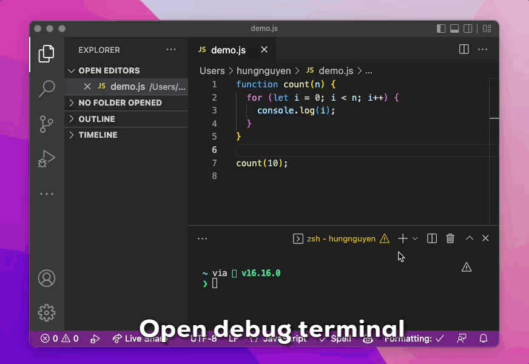

## TLDR. Just show me the demo

## Current ways to debug a Javascript application

- Chrome DevTools(insert image)
- VSCode: Requires some initial setup. Sometimes overwhelm(insert image)

## VSCode Debug Terminal

- not sure it is a new feature added recently. But I just knew this feature for a few months
- Just work
- Step 1,2,3

## Bonus

- Debug npm scripts directly (insert image)
