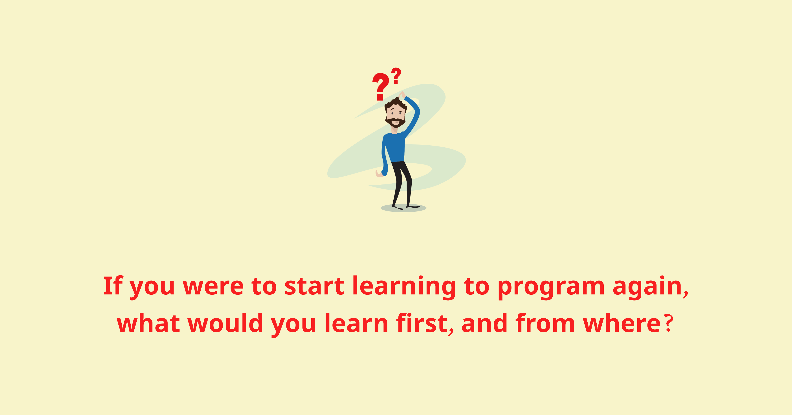
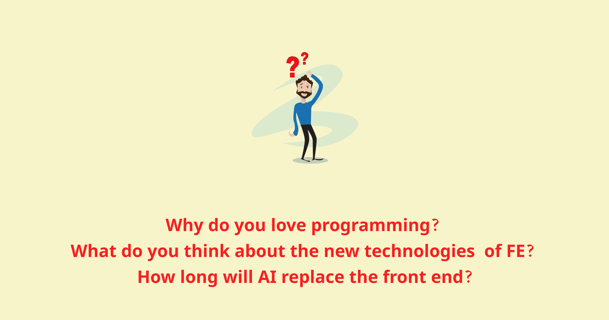

Một bạn độc giả có nhắn tin hỏi mình mấy câu. Mình nhận thấy có thể nhiều bạn cũng sẽ có những câu hỏi tương tự. Nên mình chia sẻ câu trả lời của mình tại post này luôn.

1. **If you were to start learning to program again, what would you learn first and from where? (I am happy if you can attach the reference)**

Nếu mình có cơ hội học lập trình lại, mình sẽ vẫn học như đã làm trong quá khứ. Đó là bắt đầu xây dựng kiến thức nền tảng về khoa học máy tính (Computer Science foundation) thật chắc, trước khi học bất cứ một công nghệ nào. Cá nhân mình thấy không có khoá học introductory nào tốt hơn CS50’s Introduction to Computer Science của Harvard University, được cung cấp miễn phí trên nền tảng giáo dục edx. CS50 là một món quà của thượng đế, với cách truyền tải các kiến thức máy tính khô khan qua những ví dụ vô cùng sinh động, trực quan và dễ hiểu. Điểm đặc biệt đó là CS50 được thiết kế để dành cho những người chưa có chút nền tàng gì về khoa học máy tính. Theo thống kê, 78% học sinh tham gia CS50 chưa từng biết khoa học máy tính là gì. mình đã từng giới thiệu CS50 cho rất nhiều bạn có background kinh tế, marketing, luật, thậm chí cả cháu mình mới 11 tuổi (với phụ đề tiếng Việt), và tất cả đều feedback rất tích cực về những gì họ học được từ CS50. Đối với bản thân mình, những kiến thức tiếp thu được từ CS50 là những viên gạch đầu tiên quan trọng tạo nên nền móng vững chắc giúp mình phát triển trong sự nghiệp IT sau này.

Link khoá học: https://www.edx.org/course/introduction-computer-science-harvardx-cs50x

Review về khoá học: https://huwng.wordpress.com/2015/05/30/bat-dau-hoc-lap-trinh-nhu-the-nao-gioi-thieu-khoa-hoc-cs50/

Nguồn tài liệu tham khảo về Computer Science Foundation https://vn.got-it.ai/blog/cs-foundation-101-phan-2-nguon-tai-lieu-tham-khao-cs-foundation-hay-nhat

2. **What is your learning path? (I don't know what I need to learn right now)**

Mình học qua vài nguồn sau:

- **Công việc:** Công việc hàng ngày của mình cần dùng đến cái gì thì mình sẽ chủ động đào sâu kiến thức phần đó. Sau khi tìm ra solution và giải quyết xong vấn đề, thay vì chỉ push code đi về thì mình cố gắng dành thêm một chút thời gian để tìm hiểu các vấn đề xung quanh nó và đặt ra các câu hỏi liên quan. Ví dụ nếu không sử dụng đoạn code này thì có cách nào khác không? Hay tại sao lại sử dụng thư viện A và không sử dụng thư viện B? Liệu ko sử dụng thư viện C thì mình có giải quyết được vấn đề đó không? Mình có thể tự implement lại được không? Vân vân và mây mây. Ngoài ra trao đổi với đồng nghiệp qua các buổi design review/ debate hay các hoạt động như code review cũng giúp mình cải thiện khả năng implement và tổ chức code.
- **Mã nguồn mở:** Ngoài việc tham gia các hoạt động code chung với các đồng nghiệp tại công ty, mình mở rộng thế giới quan về ngành phát triển phần mềm qua cộng đồng mã nguồn mở (Open source software - xin được gọi tắt là OSS). Khi tham gia OSS, mình sẽ hiểu hơn về các phần mềm mình hay sử dụng hàng ngày để tạo nên các sản phẩm cho công ty. Mình cũng sẽ được những engineer top đầu review code cho một cách HOÀN TOÀN MIỄN PHÍ, một điều mà hàng ngày có trả rất nhiều tiền mình cũng không có cơ hội đó được. Mình học được rất nhiều điều khi tham gia vào các hoạt động đóng góp cho OSS.
- **Chia sẻ kiến thức:** Một điều rất hay trong cộng đồng phát triển phần mềm hiện nay đó là việc chia sẻ kiến thức. Những năm gần đây phong trào này cũng phát triển rất mạnh mẽ. Thay vì biết cái gì đó thì giấu nhẹm đi chỉ để cho bản thân mình thì software engineer họ rất thích chia sẻ những gì họ biết, ví đó là cách để bản thân họ hệ thống lại kiến thức một cách tốt nhất. Vì thế nên anh khuyên tất cả các engineer nên có ít nhất cho mình một blog kỹ thuật, để có thể ghi chép lại những gì mình biết, mình học được trong quá trình làm nghề.

3. **Why do you love programming? What do you think about the new technologies of FE? How long will AI replace the front end? :D (I'm a bit confused about my career)**

**Why do you love programming?**

Có nhiều lý do để mình thích lập trình, mình sẽ chia sẻ một vài lý do khách quan và chủ quan

- Mình thấy nó công bằng và dễ tiếp cận. Lập trình không phân biệt bạn đến từ đâu, nói ngôn ngữ gì, bao nhiêu tuổi, làm nghề gì, tôn giáo gì, ngoại hình ra sao. Miễn bạn có một chiếc máy tính, một đường truyền internet tạm ổn và một trái tim nóng, một tinh thần nhiệt huyết là đủ. Bạn có thể tìm kiếm bất cứ thứ gì về lập trình từ internet mà không gặp bất cứ một trở ngại nào. Đúng là lập trình đôi lúc cũng khó, nhưng mình tin bất cứ ai, nếu đủ yêu thích và kiên trì, đều theo đuổi ngành lập trình được.
- Lập trình rất cần sự sáng tạo. Em đồng nghiệp cũ có phàn nàn với mình rằng “Làm sao bọn anh có thể ngồi nhìn vào cái màn hình máy tính xanh xanh đỏ đỏ 8 9 tiếng một ngày được? Thật khó hiểu quá đi.” (Cái “xanh xanh đỏ đỏ” đó chính là syntax highlighting 😂). Thì cũng đúng, nhưng đằng sau những dòng “xanh xanh đỏ đỏ” đó là vô cùng nhiều sự sáng tạo trong cách suy nghĩ của rất rất nhiều lập trình viên trên thế giới. Trước mình có xuất phát điểm là học sinh chuyên toán, nên mình thích làm các công việc yêu cầu sự sáng tạo nhưng vẫn phải rất chặt chẽ và logic.
- Có thể tạo ra “impact”. Với khả năng coding, mình có khả năng tạo ra các phần mềm có thể tạo ra nhiều giá trị và có sức ảnh hưởng tốt đến người khác và xã hội.
- Vẫn còn nữa nhưng tạm thời thế nhớ 😂

**What do you think about the new technologies of FE?**

Một điểm đặc trưng của thế giới FE đó là mọi thứ move rất nhanh. Đôi khi một framework ra chưa kịp học đã có framework khác thay thế rồi. Việc này là hoàn toàn bình thường. Lý do để giải thích thì có rất nhiều, như tính “mở” của Javascript, hay việc ai cũng dễ dàng có thể publish một thư viện lên các package manager (e.g: npm) cũng thúc đẩy việc ngày càng nhiều các framework FE ra đời. Nó có cả mặt lợi và hại, nhưng theo mình thì mặt lợi vẫn nhiều hơn. Khi có nhiều người cùng cạnh tranh ở một thị trường ngách, thì người hưởng lợi sẽ là người tiêu dùng. Hãy nhìn vào hạ tầng internet tại Việt Nam năm 2022 và 10 năm trước. 10 năm trước, việc download speed lên được đến 500kb/s đã là điều không tưởng, lại còn không trọn gói. Còn bây giờ. Tốc độ download lên đến 5 hay 10MB/s là chuyện hết sức bình thường. FE frameworks cũng vậy. Càng nhiều công ty, tổ chức phát triển thì các FE engineer sẽ càng hưởng lợi.
Tuy nhiên công nghệ FE có phát triển đi thế nào đi chăng nữa, thì vẫn xoay quanh câu chuyện UI có đẹp ko, UX có tốt không, page load có nhanh không, hay đi sâu hơn thì sẽ là HTML, CSS, Javascript. Hãy nắm chắc những thứ cơ bản thì không bao giờ sợ bị ngộp trước những công nghệ mới

**How long will AI replace the front end?**

Mình chịu. Chắc đành tử tế với robot bây giờ không về sau lúc nó chiếm thế giới rồi nó ghim mình thì chết.
